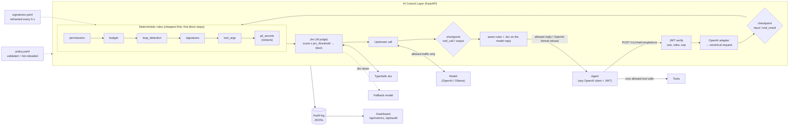

# 2. Architecture

The full design (request lifecycle, check pipeline, Jev fallback, policy store, authorization) is in [`5-implementation/docs/architecture.md`](../5-implementation/docs/architecture.md). This page has the diagram and the performance numbers.

## Architecture diagram

How a request moves:

1. The agent sends the whole conversation with a JWT. The layer verifies the token and maps the user's roles to their allowed tools.
2. The OpenAI JSON is translated into one canonical model. Checks never see vendor JSON, so another vendor is one more adapter.
3. The last message decides the checkpoint: a user prompt is `input`, a tool message is `tool_result`.
4. Rule checks run cheapest first. The first block stops the pipeline and is final. `pii_secrets` redacts and continues.
5. Jev scores the redacted text. If TypeSafe Jev fails, the fallback model judges. If both fail, the request is blocked.
6. The request goes upstream. The reply is checked again at `tool_call` (it asks for tools) or `output` (final answer). Forbidden tool calls are replaced by a notice.
7. A block returns a normal OpenAI-format refusal with the reason. Every check result is audited.

## Performance metrics

### Deterministic enforcement (rule checks)

Measured on 2026-10-04 by running 113 of the 115 data-driven test cases (all but the two "Jev unavailable" ones) from [`backend/tests/cases/`](../5-implementation/backend/tests/cases/) through the real pipeline 20 times (2,260 checkpoint runs, Jev mocked), on a laptop with a 12th-gen Intel CPU (Windows 11, Python 3.12.2). Times are per check, per checkpoint, in milliseconds.

| Check | p50 (ms) | p95 (ms) | max (ms) |
|---|---|---|---|
| `permissions` | 0.003 | 0.005 | 0.022 |
| `loop_detection` | 0.012 | 0.036 | 0.099 |
| `budget` | 0.023 | 0.045 | 0.133 |
| `tool_args` | 0.060 | 0.165 | 6.897 |
| `pii_secrets` | 0.068 | 0.158 | 0.408 |
| `signatures` | 0.069 | 0.146 | 0.618 |
| **All rules, one checkpoint** | **0.125** | **0.361** | |

Rule checks add well under a millisecond on typical agent traffic. They scale with the size of the conversation: about 9 ms on 20 KB of text, 46 ms on 200 KB of ASCII and 160 ms on 200 KB of Cyrillic (measured earlier, see [backend README](../5-implementation/backend/README.md#known-gaps)).

### Non-deterministic enforcement (Jev)

Jev is a network call to a remote LLM, so its latency is dominated by the service, not by our code. Its limits are set in the policy: `jev.timeout_s: 3` for TypeSafe Jev and `jev.fallback.timeout_s: 15` for the fallback model. A timeout counts as unavailable and fails over, then fails closed. Jev judges messages in parallel, at most `checks.jev.max_concurrency: 8` at a time.

Live latency is measured on every request and shown on the dashboard's **Overview** tab and in `GET /api/metrics`:

| Field | Meaning |
|---|---|
| `jev_latency_ms` | p50 / p95 of Jev's verdict time |
| `rules_overhead_ms` | p50 / p95 of all rule checks for one checkpoint |
| `overhead_ms` | p50 / p95 of total security overhead (rules + Jev) |
| `request_latency_ms` | p50 / p95 of pre-checks, upstream model, post-checks and total per agent step |
| `latency_ms_by_check` | p50 / p95 per check |

We did not record a Jev benchmark for this write-up. Run `docker compose run --rm test-app --scenario all` and read these fields to get numbers for your network.
