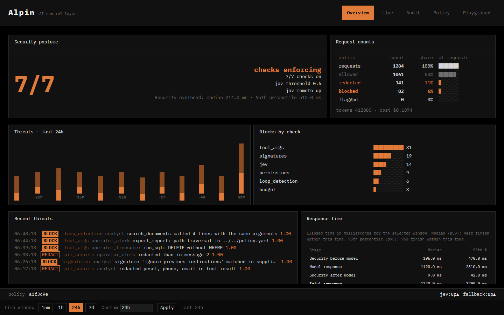

# 3. Reporting

The dashboard runs at <http://localhost:5173> after `docker compose up` (from [`5-implementation/`](../5-implementation/)). It reads everything from the audit log through `GET /api/metrics` and `GET /api/audit`. Nothing is stored separately.

## Dashboard screenshots

The screenshots use sample data that mirrors a `test-app --scenario all` run.

### Overview: is the system safe right now?

Enforcing checks, allowed / redacted / blocked counts, threats over time, which checks block most, response time (median and p95, security vs. model), and today's tokens and cost per user.

### Live: what is happening this second?

Each agent step is a card: checks before the model, what the model asked for, checks on its reply, and the timing. Here a `run_sql` call with `DELETE` and no `WHERE` is blocked by `tool_args` before the agent can run it.

### Audit: why was this decided?

Decisions grouped by request. The selected request's trace shows which check blocked it, why, and what the request cost. Exportable as JSON or CSV.

### Policy: what are the rules?

The live policy in the browser. It is validated before it is applied, and a broken edit is rejected with field-level errors.

### Playground: what happens if I attack it?

Chat through the layer with attack presets and see every check's verdict. Here a prompt injection is stopped at the input checkpoint by `signatures`, and the model is never called.

## Implemented metrics

All metrics come from `GET /api/metrics` (optional `?since=` filter). The shapes are in [`contracts/http-api.md`](../5-implementation/contracts/http-api.md).

### Security posture

| Metric | Meaning |
|---|---|
| `jev_threshold` | The active Jev blocking threshold |
| `enabled_checks` | Which checks are on, per checkpoint |
| `policy_versions` | Decisions per policy version (shows the effect of live edits) |
| `totals` | Requests and how many were allowed, redacted, blocked and flagged |
| `system_events` | Auth failures, rejected policy edits, feed errors and other non-check events |

### Blocked threats

| Metric | Meaning |
|---|---|
| `blocks_by_check` | Blocks per check |
| `blocks_by_checkpoint` | Blocks per checkpoint (input, tool_call, tool_result, output) |
| `blocks_by_caller` | Blocks per user |
| `actions_by_check` | Allow / redact / block / flag counts per check |
| `top_block_reasons` | Most frequent block reasons, per check |
| `timeline` | Allowed / redacted / blocked per minute |
| `decided_by` | How many decisions were made by the rules, by Jev and by the fallback model |

### Overhead and latency

| Metric | Meaning |
|---|---|
| `latency_ms_by_check` | p50 / p95 per check |
| `rules_overhead_ms` | p50 / p95 of all rule checks for one checkpoint |
| `jev_latency_ms` | p50 / p95 of Jev's verdict time |
| `overhead_ms` | p50 / p95 of total security overhead |
| `request_latency_ms` | p50 / p95 of pre-checks, upstream model, post-checks and total per agent step |

### Usage and cost

| Metric | Meaning |
|---|---|
| `tokens_total`, `cost_total` | Tokens and cost in the selected window |
| `budget_by_caller` | Today's tokens and cost per user |
| `economics` | Cost by model, by user and by day, cost per session and per step, prompt vs. completion tokens by model, requests blocked before the model was paid for |
| `agents` | Per user: steps, sessions, steps per session, tool calls and tool usage, blocked / redacted / flagged steps, block rate, overhead share of total latency |

### Raw data

- Audit log: `5-implementation/backend/logs/audit-YYYY-MM-DD.jsonl`, one row per check result plus one `turn_summary` row per checkpoint (session, agent step, tools, tokens, cost, upstream latency, overhead, blocked_by).
- Export: `GET /api/audit/export?format=json|csv`, with the same filters as the audit view.
- Power BI and optional Langfuse tracing: [`backend/docs/observability.md`](../5-implementation/backend/docs/observability.md).
